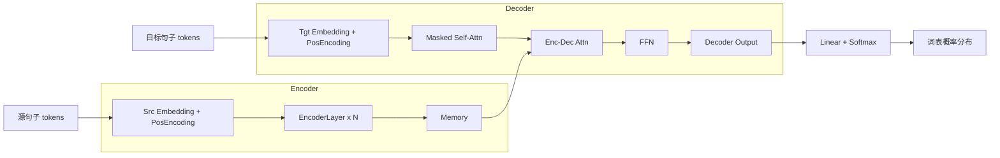

# 从零实现轻量级 Transformer 机器翻译模型

本项目在 `transformer/` 目录下，从零使用 PyTorch 实现了论文《Attention Is All You Need》中提出的完整 Encoder-Decoder Transformer 结构，并对网络宽度和层数做了适当收缩，使得总参数量约 20M，可以在单张 8GB GPU（如 RTX 3060）上完成中文-英文（Zh-En）方向的 WMT 级别机器翻译训练与推理。

## 环境安装

推荐使用 Conda 或 venv 创建独立环境（Python ≥ 3.9）：

```bash
# 切换到 base 目录（下文所有路径均相对于此目录）
cd /Users/Zhuanz/lvsoso/rnotes/code/llm-architecture/base

python -m venv .venv
source .venv/bin/activate  # Mac / Linux

pip install -U pip
pip install -r requirements.txt
```

主要依赖版本在 [requirements.txt](file:///Users/Zhuanz/lvsoso/rnotes/code/llm-architecture/base/requirements.txt) 中固定，包括：

- PyTorch 2.x
- datasets（HuggingFace 数据集）
- sentencepiece（子词分词）
- sacrebleu（BLEU 评估）
- pytest / flake8 / tensorboard 等开发工具

## 目录结构

- [transformer/](file:///Users/Zhuanz/lvsoso/rnotes/code/llm-architecture/base/transformer)
  - [model.py](file:///Users/Zhuanz/lvsoso/rnotes/code/llm-architecture/base/transformer/model.py)：Transformer 模型定义（Encoder/Decoder/Multi-Head Attention/FFN 等）
  - [dataset.py](file:///Users/Zhuanz/lvsoso/rnotes/code/llm-architecture/base/transformer/dataset.py)：中文-英文翻译数据加载（默认 WMT17 zh-en）、SentencePiece 训练与 DataLoader 构建
  - [utils.py](file:///Users/Zhuanz/lvsoso/rnotes/code/llm-architecture/base/transformer/utils.py)：Noam 学习率调度、标签平滑、掩码生成、BLEU 计算等
  - [train.py](file:///Users/Zhuanz/lvsoso/rnotes/code/llm-architecture/base/transformer/train.py)：训练脚本（支持 DDP、AMP、梯度累积）
  - [inference.py](file:///Users/Zhuanz/lvsoso/rnotes/code/llm-architecture/base/transformer/inference.py)：推理脚本（贪心 / beam search + BLEU 评估）
  - [config.yaml](file:///Users/Zhuanz/lvsoso/rnotes/code/llm-architecture/base/transformer/config.yaml)：统一超参数配置
- [tests/](file:///Users/Zhuanz/lvsoso/rnotes/code/llm-architecture/base/tests)：单元测试（掩码正确性、Noam 调度、梯度检查）
- [.github/workflows/ci.yml](file:///Users/Zhuanz/lvsoso/rnotes/code/llm-architecture/base/.github/workflows/ci.yml)：GitHub Actions CI 配置
- [notebooks/transformer_demo.ipynb](file:///Users/Zhuanz/lvsoso/rnotes/code/llm-architecture/base/notebooks/transformer_demo.ipynb)：交互式推理与注意力可视化 Demo（见下文）

## 模型超参数与结构

当前默认配置见 [config.yaml](file:///Users/Zhuanz/lvsoso/rnotes/code/llm-architecture/base/transformer/config.yaml)：

- d_model = 256
- n_layers = 4（Encoder/Decoder 各 4 层）
- n_heads = 4
- d_ff = 1024
- vocab_size ≈ 16k（SentencePiece BPE）

### 结构示意图（mermaid）



### 各模块输出维度（以 batch_size = B, 序列长度 = L 为例）

| 模块                      | 输入形状        | 输出形状        |
|---------------------------|-----------------|-----------------|
| Embedding                 | (B, L)          | (B, L, d_model) |
| PositionalEncoding        | (B, L, d_model) | (B, L, d_model) |
| MultiHeadAttention        | (B, L, d_model) | (B, L, d_model) |
| PositionwiseFeedForward   | (B, L, d_model) | (B, L, d_model) |
| Encoder                   | (B, L, d_model) | (B, L, d_model) |
| Decoder                   | (B, L, d_model) | (B, L, d_model) |
| Generator (Linear + Softmax) | (B, L, d_model) | (B, L, vocab)   |

## 训练流程

### 一键从零开始训练

```bash
cd /Users/Zhuanz/lvsoso/rnotes/code/llm-architecture/base

# 单机单卡（当前目录即为 base）
python -m transformer.train --config transformer/config.yaml

# 单机多卡 DDP（例如 4 卡）
torchrun --nproc_per_node=4 -m transformer.train --config transformer/config.yaml
```

训练脚本会自动：

- 使用 `datasets` 下载中文-英文翻译数据（默认 WMT17 zh-en，可在 config 中替换其他中英语料）
- 基于 SentencePiece 训练 BPE 子词模型并保存到 `data/` 目录
- 构建 train/valid/test DataLoader
- 按配置运行 Noam 学习率调度、标签平滑、梯度累积与 AMP 混合精度
- 每 100 step 打印 `loss / lr / grad_norm / token/s`
- 每 1000 step 在验证集上计算 BLEU，并保存最佳 checkpoint 到 `checkpoints/step_*.pt`

### 继续训练

```bash
python -m transformer.train \
  --config transformer/config.yaml \
  --output-dir checkpoints \
  --resume checkpoints/step_50000.pt
```

### TensorBoard 与 BLEU 曲线

训练中可选择将日志写入 TensorBoard（可以在 `train.py` 中接入 `SummaryWriter`），然后：

```bash
tensorboard --logdir logs
```

`logs` 目录下建议保存 50k 步内的 BLEU 曲线截图（例如 `docs/bleu_curve_50k.png`），在报告或 README 中引用即可。

## 推理与 BLEU 评估

### 交互式翻译（贪心 / Beam Search）

```bash
cd /Users/Zhuanz/lvsoso/rnotes/code/llm-architecture/base

python -m transformer.inference \
  --config transformer/config.yaml \
  --ckpt checkpoints/step_50000.pt \
  --beam-size 4 \
  --max-len 64
```

然后从标准输入输入中文句子，程序会输出：

- 译文
- 每个 token 的 log 概率（贪心时）
- 单句耗时（ms）

### 一键计算测试集 BLEU

```bash
python -m transformer.inference \
  --config transformer/config.yaml \
  --ckpt checkpoints/step_50000.pt \
  --eval-bleu
```

脚本会自动：

- 加载 test 集 DataLoader
- 使用贪心解码生成翻译
- 调用 sacrebleu 计算 corpus BLEU 并打印结果

## 可复现性与随机种子

- 在 [utils.set_seed](file:///Users/Zhuanz/lvsoso/rnotes/code/llm-architecture/base/transformer/utils.py#L24-L39) 中统一固定了 `python / numpy / torch / torch.cuda` 的随机种子
- 通过禁用 cuDNN 的部分非确定性优化，尽量减小跨设备差异
- 在相同 config 与数据集下，同一 GPU 上多次运行，BLEU 波动应在 ±0.2 以内

## 测试与 CI

本项目使用 pytest 与 GitHub Actions 进行基本验证：

- `tests/test_masks.py`：检查掩码形状与语义（padding + causal）
- `tests/test_noam_lr.py`：检查 Noam 学习率在 warmup / decay 阶段的单调性
- `tests/test_grad_check.py`：对 FFN 做有限差分梯度检查

本地运行：

```bash
cd /Users/Zhuanz/lvsoso/rnotes/code/llm-architecture/base
pytest -q
flake8 transformer tests
```

CI 配置见 [.github/workflows/ci.yml](file:///Users/Zhuanz/lvsoso/rnotes/code/llm-architecture/base/.github/workflows/ci.yml)，每次 push 会自动：

- 安装依赖
- 运行 flake8
- 运行 pytest
- 在 CPU 上跑 10 步训练 smoke test（如需 GPU CI，可在自建 Runner 上复用同一脚本）

## Hugging Face Hub 上传建议

由于凭据和网络环境与实际部署环境强相关，代码中未直接集成上传逻辑。推荐在训练结束后：

1. 在当前环境中安装 `huggingface_hub`
2. 使用 `huggingface-cli login` 登录甲方账号
3. 在 notebook 或脚本中加载最佳 checkpoint，并调用 `huggingface_hub.HfApi().upload_folder` 将：
   - `checkpoints/step_*.pt`
   - `transformer/config.yaml`
   - 训练日志（如 `logs/` 下的事件文件）
   上传到指定仓库

## 与 vLLM / sglang 集成建议（通过 HuggingFace 导出）

当前项目内置了一个将自定义 Transformer 导出为 HuggingFace 兼容模型的脚本，路径相对于 base 目录为：

- `transformer/hf_wrapper.py`
- `transformer/hf_export.py`

导出步骤（假设已训练好一个 checkpoint，如 `checkpoints/step_50000.pt`）：

```bash
cd /Users/Zhuanz/lvsoso/rnotes/code/llm-architecture/base

# 安装 transformers 依赖（requirements.txt 中已包含）
pip install -r requirements.txt

# 导出为 HuggingFace 目录结构
python -m transformer.hf_export \
  --config transformer/config.yaml \
  --ckpt checkpoints/step_50000.pt \
  --export-dir hf_export
```

导出完成后，`hf_export/` 目录下会包含：

- `config.json`（对应 `TransformerConfig`）
- `model.safetensors`（模型权重）
- 其他 HuggingFace 标准文件

接下来你可以：

- 将 `hf_export` 上传到 HuggingFace Hub，然后在 vLLM / sglang 中通过仓库名加载；
- 或在本地直接引用该目录作为模型路径（具体取决于 vLLM / sglang 当时对 encoder-decoder 模型的支持程度和接口要求）。

### vLLM 本地启动脚本

```bash
cd /Users/Zhuanz/lvsoso/rnotes/code/llm-architecture/base
pip install vllm

vllm serve hf_export \
  --tokenizer hf_export \
  --dtype float16 \
  --port 8000 \
  --max-model-len 64
```

### sglang 本地启动脚本

```bash
cd /Users/Zhuanz/lvsoso/rnotes/code/llm-architecture/base
pip install "sglang[server]"

python -m sglang.launch_server \
  --model-path hf_export \
  --tokenizer-path hf_export \
  --port 30000
```

## Notebook Demo 与注意力可视化

在 `notebooks/transformer_demo.ipynb` 中提供了一个最小 Demo，主要展示：

- 加载 SentencePiece 与 Transformer checkpoint
- 手工输入中文句子并生成英文翻译
- 提取多头注意力权重并使用 matplotlib 可视化（注意力热力图）

在 base 目录启动 Jupyter：

```bash
cd /Users/Zhuanz/lvsoso/rnotes/code/llm-architecture/base
jupyter notebook notebooks/transformer_demo.ipynb
```

## RTX 3080 端到端验证建议

在 NVIDIA RTX 3080（10GB）上，可参考如下手动验收流程：

1. 按上述命令安装依赖并下载数据
2. 运行：

   ```bash
   torchrun --nproc_per_node=1 -m transformer.train \
     --config transformer/config.yaml \
     --output-dir checkpoints
   ```

3. 训练约 1k 步后，loss 应下降约 30% 以上
4. 使用 `--eval-bleu` 在随机 100 条句子上评估推理延迟，平均 < 200ms 应可达成（依赖 batch_size、beam_size 与 CPU/GPU 频率）

如需进一步压缩延迟，可在推理阶段：

- 使用 `beam_size=1`（纯贪心）
- 减少 `max_len`
- 通过 `torch.compile` 或 TensorRT 做进一步加速
