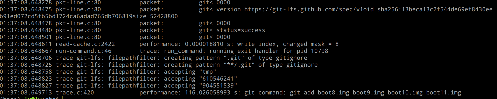
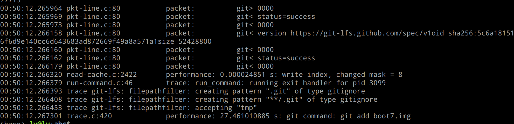

### git add 

#### env
- git version version 2.25.5
- Ubuntu 18.04.6 LTS
- Intel(R) Core(TM) i5-9600KF CPU @ 3.70GHz
- git-lfs/3.2.0 (GitHub; linux amd64; go 1.18.2)

#### add lfs file

设置trace

```shell
export GIT_TRACE=1
export GIT_TRACE_PACKET=1
export GIT_TRACE_PERFORMANCE=1
export GIT_TRACE_SETUP=1
export GIT_CURL_VERBOSE=1
export GIT_TRANSFER_TRACE=1
```






跟踪调用

```shell
(gdb) bt 20
#0  start_command (cmd=0x555555b44858) at run-command.c:674
#1  0x00005555557b35ad in subprocess_start (hashmap=0x555555b02e20 <subprocess_map>, 
    entry=0x555555b44840, cmd=0x555555b44160 "git-lfs filter-process", 
    startfn=0x555555695f58 <start_multi_file_filter_fn>) at sub-process.c:95
#2  0x0000555555696188 in apply_multi_file_filter (path=0x555555b4dd94 "2.bin", src=0x0, len=0, fd=4, 
    dst=0x7fffffffc940, cmd=0x555555b44160 "git-lfs filter-process", wanted_capability=1, dco=0x0)
    at convert.c:824
#3  0x0000555555696830 in apply_filter (path=0x555555b4dd94 "2.bin", src=0x0, len=0, fd=4, 
    dst=0x7fffffffc940, drv=0x555555b44100, wanted_capability=1, dco=0x0) at convert.c:992
#4  0x0000555555697974 in convert_to_git_filter_fd (istate=0x555555b37740 <the_index>, 
    path=0x555555b4dd94 "2.bin", fd=4, dst=0x7fffffffc940, conv_flags=18) at convert.c:1444
#5  0x00005555557996b5 in index_stream_convert_blob (istate=0x555555b37740 <the_index>, 
    oid=0x7ffff7ec2070, fd=4, path=0x555555b4dd94 "2.bin", flags=1) at sha1-file.c:2024
#6  0x0000555555799a6d in index_fd (istate=0x555555b37740 <the_index>, oid=0x7ffff7ec2070, fd=4, 
    st=0x7fffffffcb00, type=OBJ_BLOB, path=0x555555b4dd94 "2.bin", flags=1) at sha1-file.c:2116
#7  0x0000555555799c62 in index_path (istate=0x555555b37740 <the_index>, oid=0x7ffff7ec2070, 
    path=0x555555b4dd94 "2.bin", st=0x7fffffffcb00, flags=1) at sha1-file.c:2142
#8  0x000055555573b389 in add_to_index (istate=0x555555b37740 <the_index>, path=0x555555b4dd94 "2.bin", 
    st=0x7fffffffcb00, flags=0) at read-cache.c:773
#9  0x000055555573b5b9 in add_file_to_index (istate=0x555555b37740 <the_index>, 
    path=0x555555b4dd94 "2.bin", flags=0) at read-cache.c:806
#10 0x0000555555571c07 in add_files (dir=0x7fffffffcc60, flags=0) at builtin/add.c:398
#11 0x00005555555724f3 in cmd_add (argc=1, argv=0x7fffffffd118, prefix=0x0) at builtin/add.c:570
#12 0x000055555556fddb in run_builtin (p=0x555555ae2020 <commands>, argc=2, argv=0x7fffffffd110)
    at git.c:444
#13 0x000055555557014c in handle_builtin (argc=2, argv=0x7fffffffd110) at git.c:674
#14 0x0000555555570411 in run_argv (argcp=0x7fffffffcfbc, argv=0x7fffffffcfb0) at git.c:741
#15 0x00005555555708bb in cmd_main (argc=2, argv=0x7fffffffd110) at git.c:872
#16 0x0000555555640ee5 in main (argc=3, argv=0x7fffffffd108) at common-main.c:52
```

有个 for-loop

```c
static int add_files(struct dir_struct *dir, int flags)
{
	int i, exit_status = 0;

	if (dir->ignored_nr) {
		fprintf(stderr, _(ignore_error));
		for (i = 0; i < dir->ignored_nr; i++)
			fprintf(stderr, "%s\n", dir->ignored[i]->name);
		fprintf(stderr, _("Use -f if you really want to add them.\n"));
		exit_status = 1;
	}

	for (i = 0; i < dir->nr; i++) {
		if (add_file_to_index(&the_index, dir->entries[i]->name, flags)) {
			if (!ignore_add_errors)
				die(_("adding files failed"));
			exit_status = 1;
		} else {
			check_embedded_repo(dir->entries[i]->name);
		}
	}
	return exit_status;
}
```


### 加快？

git-lfs 这里会对输入进行检查，如果是个合格的point文件，就不会再进行计算。

[https://github.com/git-lfs/git-lfs/blob/main/commands/command_clean.go#L24](https://github.com/git-lfs/git-lfs/blob/main/commands/command_clean.go#L24)
```go
// If the object read from "from" is _already_ a clean pointer, then it will be
// written out verbatim to "to", without trying to make it a pointer again.
```