## 一、AI Agent 使用


在Agent内部，大模型被用作推理引擎以确定采取哪些操作以及按什么顺序执行这些操作

操作的序列并非硬编码在代码中，而是使用大模型来选择执行的操作序列。

### 当前的一些产品/工具开源实现

#### Manus
[manus.im](https://manus.im/?index=1)

[sound app](https://manus.im/share/QfmleZqV5JDSk5uPYijvt2?replay=1)

[sound app online](https://wctwhram.manus.space/)


#### OpenManus
[repo](https://github.com/mannaandpoem/OpenManus/tree/main)


```shell
Manus -> ToolCallAgent -> ReActAgent -> BaseAgent
```

[BaseAgent](https://github.com/mannaandpoem/OpenManus/blob/main/app/agent/base.py)

[ReActAgent](https://github.com/mannaandpoem/OpenManus/blob/main/app/agent/react.py)

[ToolCallAgent](https://github.com/mannaandpoem/OpenManus/blob/main/app/agent/toolcall.py)

[Manus](https://github.com/mannaandpoem/OpenManus/blob/main/app/agent/manus.py)


### 实现一个agent
- 主要功能
    - 鉴权/数据隔离
    - 记忆存储、搜索 *
    - 思考决策  *
    - 模型推断
    - 工具使用  *

- 指标监测

#### 能做的地方
- 执行框架
- 记忆
- 工具

### 执行框架
 
#### ReAct


| 框架              | 概述                                                                                                                                                              | 结果                                     |
|-------------------|-------------------------------------------------------------------------------------------------------------------------------------------------------------------|------------------------------------------|
| 标准 (Standard)   | 直接给出错误的答案——**iPod**。没有任何推理过程或外部交互，直接给出答案                                                                                                   | **错误的答案：** iPod                    |
| 仅推理 (Reason only) | 尝试通过逐步推理来解决问题，但没有与外部环境交互来验证信息。错误地推断出答案是**iPhone、iPad、iPod Touch** | **错误的答案：** iPhone、iPad、iPod Touch |
| 仅行动 (Act only)   | 仅行动 (Act) 通过与外部环境（如维基百科）的一系列交互来获取信息，尝试多次搜索（搜索 “Apple Remote” “Front Row”等），但缺乏推理支持，未能综合这些观察结果后得出正确答案。认为需要结束搜索 | **错误的决策：** 结束搜索                  |
| ReAct             | 组合推理和行动。首先通过推理确定搜索Apple Remote（苹果遥控器），并从外部环境中观察结果。随着推理的深入，识别出需要搜索Front Row（软件）。在几轮交互后，通过进一步推理，准确得出答案：键盘功能键 | **正确的答案：** 键盘功能键                |

### 记忆

#### RAG

```mermaid
graph TD;
    A["用户提问 (User Query)"] --> B("检索模块 / Retriever");
    C["知识库 / Knowledge Base\n(例如：向量数据库, 文档集合, API等)"];
    B -- "1\. 使用提问进行语义搜索或查询" --> C;
    C -- "2\. 返回相关文档片段/上下文 (Relevant Chunks/Context)" --> B;
    B -- "3\. 检索到的上下文" --> D{"组合模块 / Combiner"};
    A -- "4\. 原始提问" --> D;
    D -- "5\. 构建增强提示 (Augmented Prompt)" --> E["大型语言模型 (LLM)"];
    E -- "6\. 基于增强提示生成答案" --> F["最终回复 (Final Response)"];
    F --> G(("用户"));

    %% Styling (optional)
    classDef default fill:#f9f9f9,stroke:#333,stroke-width:2px;
    classDef process fill:#00f,stroke:#333,stroke-width:2px;
    classDef kb fill:#lightgrey,stroke:#333,stroke-width:2px;
    classDef llm fill:#000,stroke:#333,stroke-width:2px;

    class A,F,G default;
    class B,D process;
    class C kb;
    class E llm;
```



